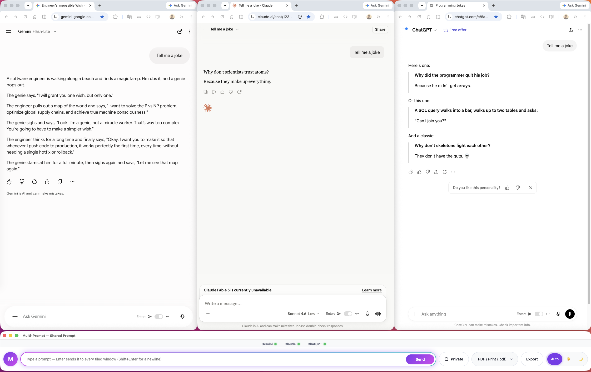

# Multi-Prompt Chrome Extension 🚀

The Multi-Prompt Chrome Extension is a powerful productivity tool that allows you to control multiple AI chatbots—Gemini, Claude, and ChatGPT—simultaneously from a single, persistent Side Panel interface.

Instead of copying and pasting your prompts across different tabs, this extension puppets the native web interfaces of the chatbots, allowing you to seamlessly start new chats, launch missing tabs, and inject prompts into all of them with a single click or keyboard shortcut.

## Features ✨

- **Multi-Model Support:** Select any combination of Gemini, Claude, and ChatGPT (from 1 to all 3).
- **Persistent Side Panel UI:** A beautiful, responsive side UI that stays with you as you navigate the web.
- **Smart "Ensure Tabs":** Click "Ensure tabs" to instantly verify the selected chatbots are open. If they aren't, it seamlessly launches them right next to each other.
- **Master "New Chat" Control:** Instantly clear the conversational context and start fresh threads out of all selected models simultaneously.
- **Intelligent Prompt Injection:** Send complex, multi-line prompts to all chosen Chatbots at once.
- **Keyboard Shortcuts:** Use `Shift + Enter` in the prompt box to send prompts without lifting your hands from the keyboard.

## How It Works ⚙️

Because modern AI chatbots enforce strict Cross-Origin Resource Sharing (CORS) and `X-Frame-Options` headers to prevent their UI from being embedded in `<iframe>` tags, embedding them directly into an extension is impossible.

This extension solves that problem by using **Chrome Content Scripts**.

1. The **Side Panel** acts as the command center, capturing your prompt and selections.
2. It sends instructions down to a **Background Service Worker** (`background.js`).
3. The Service worker routes those instructions to **Content Scripts** (`content/*.js`) which are invisibly injected onto the active AI websites.
4. These scripts emulate real human behavior—locating the specific React/ProseMirror DOM elements, injecting the text, dispatching synthetic keystroke events, and clicking the "Send" or "New Chat" buttons for you natively!

## Installation from Source 💻

Since this is an unpacked developer extension, you can install it natively in your browser in just a few seconds:

1. **Download/Clone the Source:** Make sure you have this `multi-prompt` folder saved somewhere memorable on your computer.
2. **Open Chrome Extensions:** Open Google Chrome and type `chrome://extensions/` into your address bar, then hit Enter.
3. **Enable Developer Mode:** In the top right corner of the Extensions page, toggle the **Developer mode** switch to **ON**.
4. **Load Unpacked:** Click the **Load unpacked** button that appears in the top left.
5. **Select the Folder:** Browse to the `multi-prompt` folder (the directory containing the `manifest.json` file) and select it.
6. **Pin It!:** Click the puzzle piece icon next to your Chrome address bar, find "Multi-Prompt", and click the pushpin icon to stick it to your taskbar for easy access.

Enjoy supercharged multi-AI prompting!
