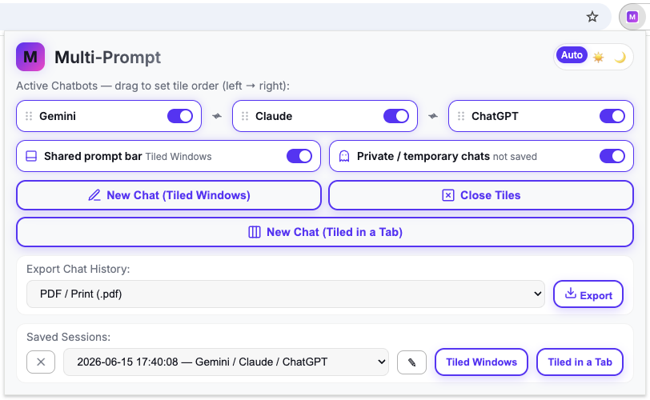
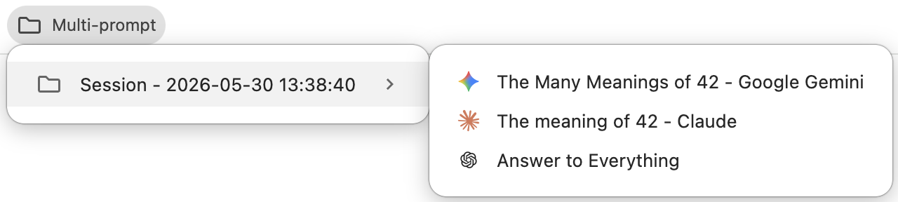
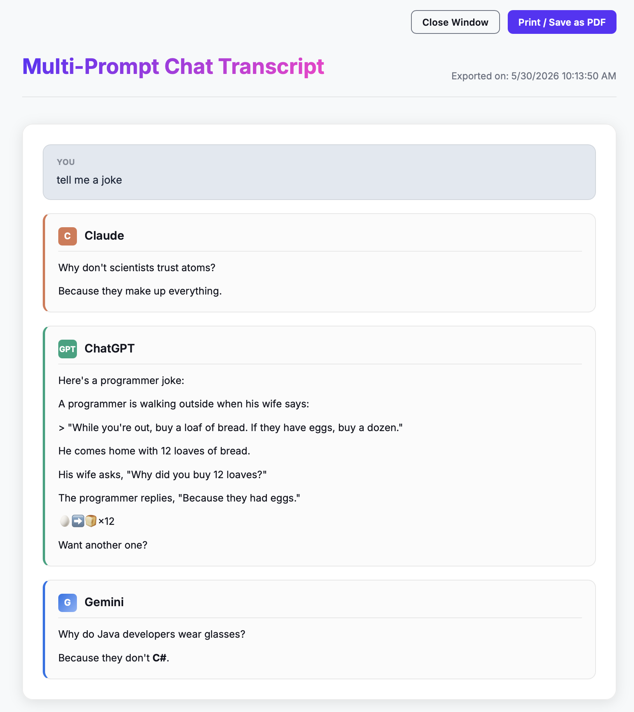

# [Multi-Prompt](https://www.linkedin.com/pulse/multi-prompt-sandip-chitale-0ktrc) Chrome (and Safari) Extension 🚀

Multi-Prompt is a productivity tool that runs Gemini, Claude, and ChatGPT side-by-side and synchronizes your prompts across all of them. Type a prompt once and it is broadcast and submitted to every selected chatbot — then export every model's answer to the same prompt, perfectly aligned.



It offers **two side-by-side layouts**:

- **Tiled Windows** — each chatbot in its own tiled OS window (works in Chrome and Safari). Optionally add a **shared prompt bar**: a thin, chrome-less app window docked across the bottom that broadcasts one prompt to every tiled window — the same "type once" experience as Tiled in a Tab, available on Safari too.
- **Tiled in a Tab** — all chatbots as tiles inside a single browser tab, with a shared prompt box, resizable splitters, and full tile management: reorder, collapse, and maximize (experimental, Chrome only). You can open as many of these tabs as you like.


## Features ✨

- **Multi-Model Support:** Select any combination of Gemini, Claude, and ChatGPT (from 1 to all 3).
- **Two layouts, one model:**
  - **New Chat (Tiled Windows)** tiles the selected chatbots in separate OS windows. Only one set of tiled windows exists at a time.
  - **New Chat (Tiled in a Tab)** opens the chatbots as iframe tiles in one tab with a shared prompt box; drag the splitters between tiles to resize. Open multiple such tabs — each tab's prompt box broadcasts only to that tab's tiles. Each tile's titlebar shows a green/red **connection dot** plus a **✓ / ✗ / … badge** for whether the last prompt reached that chatbot.
- **Tile Management (Tiled in a Tab):**
  - **Reorder** tiles by dragging a titlebar (the grip dots mark the handle).
  - **Collapse** a tile to a narrow sliver with its rotated title — the chat stays loaded and still receives broadcasts; click the sliver to expand it again. At least one tile always stays expanded.
  - **Maximize** a tile (button or double-click its titlebar) to collapse the others to slivers; restore the same way — the exact previous layout, including widths, comes back. Titlebar buttons and splitters appear only in states where they can actually do something.
- **Prompt Broadcasting:** In Tiled Windows mode, type natively in any chatbot and it replicates to the others — or enable the **shared prompt bar** (see below) to type once and broadcast to every window. In Tiled in a Tab mode, type in the shared prompt box and it broadcasts to every pane.
- **Shared Prompt Bar (Tiled Windows):** Tick **Shared prompt bar** in the popup before starting (or reopening) a Tiled Windows session and the extension docks a thin, chrome-less app window across the bottom of the screen, below the tiled chatbot windows. It mirrors the Tiled-in-a-Tab bottom bar: the glowing shared prompt pill with **Send**, a **Private** toggle, **Export** (+ format), the **theme** switch, and a row of per-model chips — each a name, a green/red **connection dot**, and a **… / ✓ / ✗** delivery badge for the last prompt. Type once and Enter broadcasts to every tiled window. This brings the "type once" experience to **Safari**, where Tiled in a Tab can't run. While the bar is shown it also **hosts the panel `[M]` button** (opens the popup), and the in-page floating `[M]` button is removed from each chatbot window so there's a single, obvious control. Sizing adapts per browser so the bar never clips. On Safari, **Close Tiles** also closes the standalone popup window the `[M]` button opens.
- **Exact Cross-Model Alignment:** Each broadcast is stamped with a shared, hidden **turn id** (a `data-mp-turn` DOM attribute added _after_ the message is sent — never injected into the prompt text the model sees). Export uses these ids to group every model's answer to the same prompt exactly, even when two prompts are textually identical.
- **Robust Text Injection:** Prompts are inserted into each site's rich editor (ProseMirror, Gemini's `rich-textarea`, Lexical) through a verified strategy chain — `execCommand` → synthetic paste → direct DOM. The fill is read back and re-applied if the editor silently rejects it (long prompts can otherwise be dropped), and submission waits for a real, clickable send button (so a prompt is never sent while a previous response is still streaming). After clicking, it **confirms the send actually landed** — a freshly rendered user turn, a conversation-permalink URL change, or a cleared composer — before ever retrying, so a site that's merely slow to clear its box never receives the same prompt twice.
- **Automatic Session Saving:** Every conversation — in either mode — is auto-saved as a session, lazily on the first prompt (so opened-but-unused windows/tabs leave nothing behind). Sessions are stored as Chrome bookmark folders (or `chrome.storage.local` on Safari).
- **Saved Sessions Picker:** Reopen any saved session from the popup — as **Tiled Windows** or **Tiled in a Tab** — rename it inline, or delete it. Reopening re-tiles the saved conversations in order and **reattaches** the original turn ids, so exported alignment survives a reload.
- **Visual Tiling Order & Drag-to-Reorder:** Select chatbots and arrange their left-to-right order from one row in the popup. In Tiled Windows mode, dragging a card physically slides the open windows to match.
- **Export Chat History:** Export from the popup, from a Tiled-in-a-Tab tab's own **Export** button, or from the **shared prompt bar's** Export button, into Markdown (`.md`) or a clean PDF / print template grouped by prompt.
- **Theme:** Auto / Light / Dark — switchable from the popup, the Tiled-in-a-Tab bottom bar, or the shared prompt bar, and kept in sync across the popup, the export view, and every workspace tab and bar.




## How It Works ⚙️

Because AI chatbots enforce strict security policies, the extension combines a **Background Service Worker** with **Content Scripts**:

1. The **Popup** (`popup.html` / `popup.js`) is the dashboard for selecting models, ordering them, starting either mode, exporting, and managing saved sessions. Preferences persist in `chrome.storage.local`.
2. The **Service Worker** (`background.js`) is the coordinator. It tiles/swaps windows, mints a shared **turn id** per broadcast, tracks managed windows and workspace tabs in `chrome.storage.session`, and persists sessions.
3. **Content Scripts** run inside the chatbot pages. A shared module (`content/common.js`) holds all cross-site logic (safe injection, turn tagging, history extraction, echo-loop guarding); the per-site files (`content/claude.js`, `content/chatgpt.js`, `content/gemini.js`) supply only that site's selectors and "new chat" behaviour.
4. **Turn alignment** is shared by both export paths via `align.js`: answers are grouped across models **by turn id**, falling back to fuzzy prompt matching only for untagged turns.

### Tiled in a Tab (iframe mode)

The chatbot sites forbid being embedded in a frame (via `X-Frame-Options` and CSP `frame-ancestors`). While a workspace tab is open, the extension installs a tab-scoped `declarativeNetRequest` rule that removes those response headers **for sub-frame loads in that tab only**, so the chatbots can be tiled as iframes. The panes use your browser's real logged-in sessions — there are no API keys.

Notes and limitations:

- **Sign in first.** Logging in (and some session refreshes) can't happen inside an embedded frame; sign in to each chatbot in a normal tab beforehand. The panes then share that session.
- **Chrome only.** Safari's `declarativeNetRequest` cannot remove *response* headers at all ([WebKit bug 275158](https://webkit.org/b/275158)), so Tiled in a Tab cannot work there; the extension probes for this at open time and explains, rather than showing dead panes. Tiled Windows remains the Safari path — and the **shared prompt bar** gives it the same "type once, broadcast to all" experience without any framing. Browsers that can remove response headers but lack per-tab (`tabIds`) rule scoping, such as Firefox, fall back to a rule that applies browser-wide — but still only while a workspace tab is open.
- **Security trade-off.** Removing the CSP also drops the framed page's own in-frame XSS protections. The rule is session-only, sub-frame-only, and pinned to the workspace tab to keep this contained.

### Shared prompt bar (Tiled Windows)

The bar (`promptbar.html` / `promptbar.js`) is an extension-owned `popup`-type window the service worker docks across the bottom of the work area, sizing the chatbot windows into the space above it. It needs **no** header-stripping (the chatbots stay in their own real windows), which is why it works on Safari. Its Send reuses the same `broadcast_prompt` path native typing uses — minting one shared turn id and injecting into every tiled window — so export alignment and the "never double-post" send confirmation work identically. Per-model delivery badges come from each window's content script reporting back, forwarded only to the bar.

### Durable sessions

Each session is a bookmark sub-folder under a `"Multi-prompt"` parent: one bookmark per chatbot (kept pointed at the live conversation permalink as it stabilises) plus one or more **bookkeeping bookmarks** that store the model order and the turn-id ledger as JSON on the reserved `multi-prompt.invalid` host (so they can never navigate anywhere; the extension skips them when reopening). Long sessions spread the ledger across **sequenced** bookkeeping bookmarks (`… -02`, `… -03`, …) to stay within bookmark URL limits. On Safari, sessions are stored in `chrome.storage.local` instead.

## Permissions

- `tabs`, `windows` — find, position, resize, and swap the chatbot windows/tabs.
- `storage` — preferences (`local`) and the set of managed windows / workspace tabs (`session`).
- `bookmarks` — auto-save each session as a folder under the Bookmarks Bar, and list/reopen/rename/delete saved sessions.
- `declarativeNetRequestWithHostAccess` — strip framing headers for the chatbot origins inside an open Tiled-in-a-Tab tab (scoped to sub-frames in that tab).
- `host_permissions` for `gemini.google.com`, `claude.ai`, and `chatgpt.com` — to run the content scripts on those sites only.

## Installation from Source 💻

### Chrome

1. **Download/Clone the Source:** Save this `multi-prompt` folder somewhere on your computer.
2. **Open Chrome Extensions:** Go to `chrome://extensions/`.
3. **Enable Developer Mode:** Toggle **Developer mode** on (top right).
4. **Load Unpacked:** Click **Load unpacked** and choose the `multi-prompt` folder (the directory containing `manifest.json`).
5. **Pin It:** Click the puzzle-piece icon next to the address bar and pin "Multi-Prompt".

### Safari

Multi-Prompt works on Safari too (Tiled Windows mode; Tiled in a Tab is Chrome-only). Follow Apple's instructions for [temporarily installing a Safari web-extension folder](https://developer.apple.com/documentation/safariservices/running-your-safari-web-extension#Temporarily-install-a-web-extension-folder-in-macOS-Safari).

## Project Structure 🗂️

```
manifest.json        Manifest V3 config, permissions, content-script matches
background.js        Service worker: tiling, broadcast, turn ids, sessions, DNR rules
popup.html/.css/.js  Popup dashboard (model selection, modes, export, sessions)
align.js             Shared cross-model turn alignment + export helpers
bar.css              Shared bottom-bar styling (workspace composer + prompt bar)
bar-common.js        Shared bottom-bar JS (theme, prompt autosize, delivery badges, export-format pref)
workspace.html/.js   Tiled-in-a-Tab page: iframe tiles (reorder/collapse/maximize), splitters, shared prompt box, Export
promptbar.html/.js   Tiled-Windows shared prompt bar: docked app window, broadcasts to every tiled window (Private/Export/theme)
export.html/.js      Markdown → print/PDF transcript view
content/common.js    Shared content-script logic (injection, tagging, extraction)
content/{gemini,claude,chatgpt}.js   Per-site selectors and behaviours
icons/               Toolbar/action icons
```

Enjoy supercharged multi-AI prompting!
